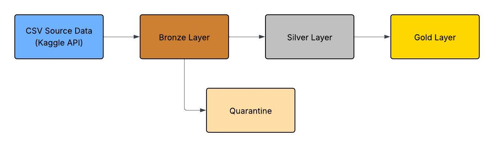
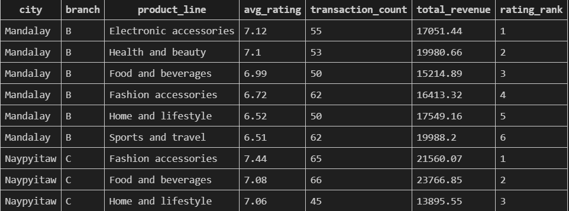
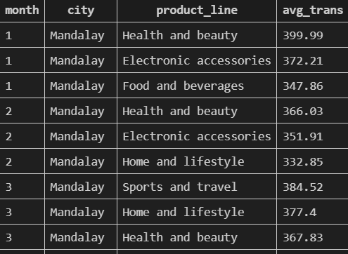
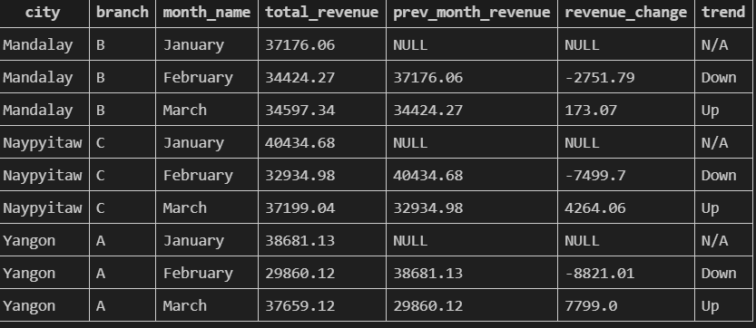
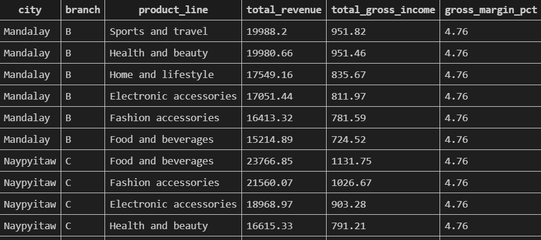

# Supermarket Sales
## Project Overview
 This is a medallion architecture data pipeline built with Python that ingests Sales of a Supermarket data from Kaggle.com This pipeline applies data quality checks, ensures idempotency, and uses SQLite to load data into a dimensional modeled database.

## Project Structure
    

project/
|- data/
  |- raw/
  |- bronze/
  |- silver/
  |- gold/
|-notebooks
  |- python-etl.ipynb
|-SQL Queries
  |- create_tables.sql
  |- Average Rating by Category and Branch.sql
  |- Average Transaction by Store, Product, Month.sql
  |- Monthly Revenue by Branch.sql
  |- Reveune and Income by Store.sql
|- supermarket_sales.db
|-requirements.txt
|-README.md

## Requirements
- Python version 3.14.13
- pandas
- sqlite
- os
- sys

## Setup
### Kaggle API Configuration
- Kaggle API Documentation is located in the kaggle-cli GitHub at https://github.com/Kaggle/kaggle-cli
- To generate a Kaggle API , navigate to Kaggle.com and navigate to the settings. Scroll to API Tokens and click Create Legacy API Key.
- This will download kaggle.json

## Data Source
- The source for the data in this project is located at https://www.kaggle.com/datasets/lovishbansal123/sales-of-a-supermarket


## Pipeline
### 1. Extraction
- Data is pulled in via the Kaggle API and the CSV files are saved to the /data/raw/ folder.
- Data is then written to a bronze parqet file in its ingested state.
- Data is cleaned, normalized, and run through data quality check before being written to silver parquet tables.

### 2. Schema Design
#### Dimensions
- dim_customer 
- dim_store
- dim_date
- dim_product
#### Fact Table
- fact_sales


### 3. Tranform and Load
- Data is cleaned for negative values in numerical columns, null values, and duplicate records on invoice_id.
- Quarantine logic is include that stores violations to a quarantine table with reason.
- Surrogate keys are assigned in an incremental manner in dimension tables. 
- 
### 4. Reporting
- Product Rating Rankings by City - Ranks the product lines by the average customer rating by city. Includes transaction count and total revenue.    


    


- Top 3 Product Lines by Average atransaction Values - Ranks product lines by average transaction value by city and month. Only the top three categories are returned.    


    


- Month over Month Revenue Trend by Branch - Compares revenue by store and month to previous month. Provides insight to revenue treands.    


    


- Gross Margain and Revenue By Product Line and Store - Sums total revenue, gross income, and gross margin percent by product line across store/city.    




### 5. Cloud Deployment
Cloud Deployment of Sales of a Supermarket Pipeline

-Source Data - Data is pulled in from the Kaggle API in the form of CSV files.
-Cloud Storage - CSV files are stored in cloud storage - Amazon S3, Azure Data Lake Storage, Google Cloud Storage. Objects land in cloud storage and serve as the beginning point of the pipeline.
-Orchestration  - Orchestration can be done through Databricks Lakeflows. This would allow data to be pulled in and data quality checks to be run on the data based on appropriate triggers. Lakeflows can be scheduled to run batches, upon file arrival, or on a continuous basis. Lakeflows also allows orchestration with dependencies, ensuring that downstream tasks are only executed if upstream tasks succeed.For this application, I believe that Auto Loader would be ideal as it would ensure that files are loaded as they arrive and would ensure that each file is processed only once.
-Bronze Layer - Auto Loader detects new files and loads the raw data into Bronze level tables as Delta tables. No transformations are applied on the bronze level and this layer serves as a historical record of the raw data.
-Silver Layer - Bronze data is cleaned and normalized into the silver layer. Column names are cleaned, data types are cast, duplicated records are identified, and null values are flagged. Records that violate the data quality constraints are then quarantined into a separate Delta table for later review.
-Gold Layer - Silver level data is modeled into fact and dimension tables. Dimensions include date, product, store, and customer.  Surrogate keys are assigned in the dimension tables with foreign key relationships established with the fact table. The gold layer tables will be used as a source of truth and will be used for reporting.
-Data Warehouse - Bronze, Silver, and Gold level tables are all stored in Delta tables, allowing for time travel recovery and transactional logging. Gold level tables are written to the data warehouse. This can be done through Databricks SQL, Google BigQuery, Azure SQL Database, Snowflake and others. 
-Security - Kaggle API credentials can be stored using Databricks secrets. This ensures that the API key is not hardcoded into the pipeline. Role based access control will be applied at all levels, limiting access to Bronze and Silver layers to service accounts and engineers, with Gold level tables being available to analysts and business intelligence tools. Proper governance and access of the data ensures that access is provided to only those who need it.
-Continuous Integration/Continuous Deployment - Pipeline code is maintained and version controlled in a GitHub repository. Changes are deployed to Databricks through GitHub actions. Development is done in a dev environment against a snapshot of data from the production environment. Once integration and unit testing is passed in dev, code changes are promoted to production and deployed.
-Monitoring - Databricks provides observability into pipeline runs. Pipeline failures can be alerted via email, Slack, Microsoft Teams, ensuring that pipeline failures are caught and addressed quickly.
-BI/Reporting - Analytical reports are created by querying the Gold level data. Queries join the fact and dimension tables to aggregate data to provide insight to key performance indicators. Business Intelligence tools can be connected to the Gold level to create visualization and create reports that can be refreshed on a schedule.    


![[Cloud Deployment]](Images/Cloud Deployment (1).jpeg)    

### 6. How to Run Pipeline
#### Prerequisites
- Python 3.x installed
- Kaggle account with API token generated
- Dependencies installed:
```bash
pip install -r requirements.txt
```

#### Kaggle API Setup
1. Generate a Kaggle API token at https://www.kaggle.com/account
2. Place kaggle.json in ~/.kaggle/
3. Ensure permissions are set correctly:
```bash
chmod 600 ~/.kaggle/kaggle.json
```

#### Running the Pipeline
Run the notebook:

**python-etl.ipynb** — Runs the full pipeline - extraction, transformation, loading. Pulls the dataset 
from Kaggle, cleans and validates the data, builds dimension and fact tables, 
and loads everything into SQLite and parquet files.

Run all cells top to bottom. Cells are organized in the following order.

### Running the Report Queries
Open a SQLite connection to supermarket.db and execute:
```bash
sqlite3 supermarket.db < SQL Queries\Average Rating by Category and Branch.sql
```
```bash
sqlite3 supermarket.db < SQL Queries\Average Transaction by Store, Product, Month.sql
```
```bash
sqlite3 supermarket.db < SQL Queries\Monthly Revenue by Branch.sql
```
```bash
sqlite3 supermarket.db < SQL Queries\Reveune and Income by Store.sql
```
Or run the queries directly in the notebook using:
```python
import sqlite3
import pandas as pd

conn = sqlite3.connect('supermarket.db')
df = pd.read_sql("SELECT * FROM fact_sales", conn)
```
### 7. Notes and Issues